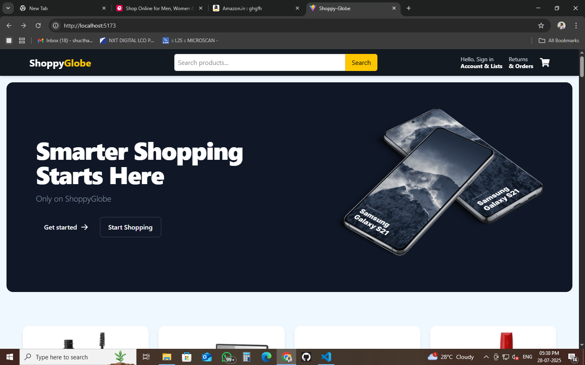
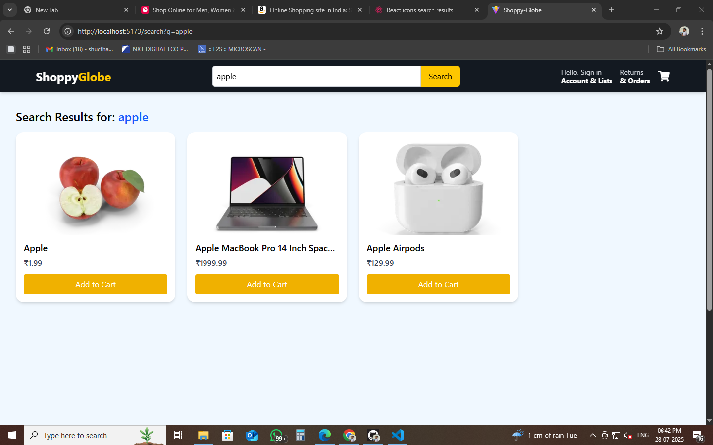
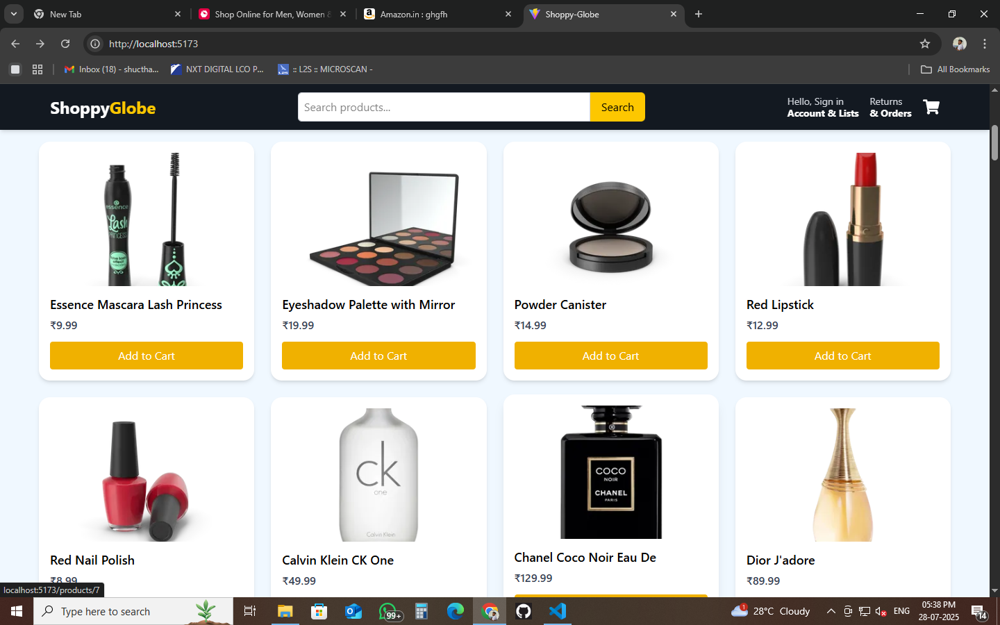

#  ShoppyGlobe – E-commerce React Application

**ShoppyGlobe** is a fully responsive e-commerce web application inspired by Amazon.in. Built with **React**, **Redux Toolkit**, **React Router**, and **Tailwind CSS**, it allows users to explore products, search and filter, view detailed product information, and manage a shopping cart with a sleek and modern UI.

---

##  Features

-  Add/Remove products from cart
-  View detailed product information
-  Persistent cart using Redux Toolkit
-  Routing using React Router
-  Lazy loading with `React.lazy` and `Suspense`
-  Responsive & mobile-friendly UI
-  Styled with Tailwind CSS
-  Fast development using Vite

---

##  Tech Stack

| Technology       | Description                           |
|------------------|----------------------------------------|
| React            | UI library for building components     |
| Redux Toolkit    | Efficient state management (cart, search) |
| React Router DOM | SPA navigation and route handling      |
| Tailwind CSS     | Utility-first CSS framework            |
| Vite             | Lightning-fast build tool              |
| React Icons      | Icon library                           |

---

##   Screenshots

###   Home Page
Displays product listings and search bar  


###   Search Results
Results shown when a user searches for products  


###  Product Details
Displays detailed information about a selected product  


###  Cart Page
Manage cart items with dynamic count and totals  


> Make sure to create a `/screenshots` folder in your project root and include the above images with correct file names.

---

##  Getting Started

### 1. Clone the repository

```bash
git clone https://github.com/Raj-2151-raj/Shoppy-Globe.git
cd Vite-project
npm intall
npm run dev
